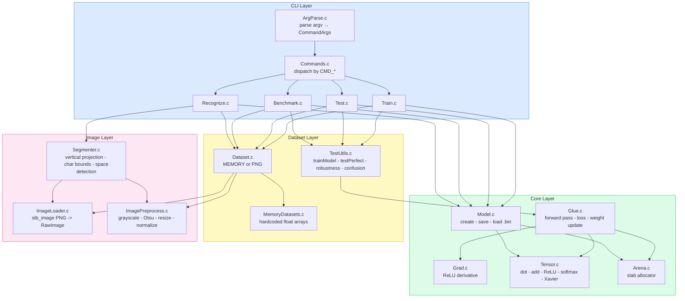
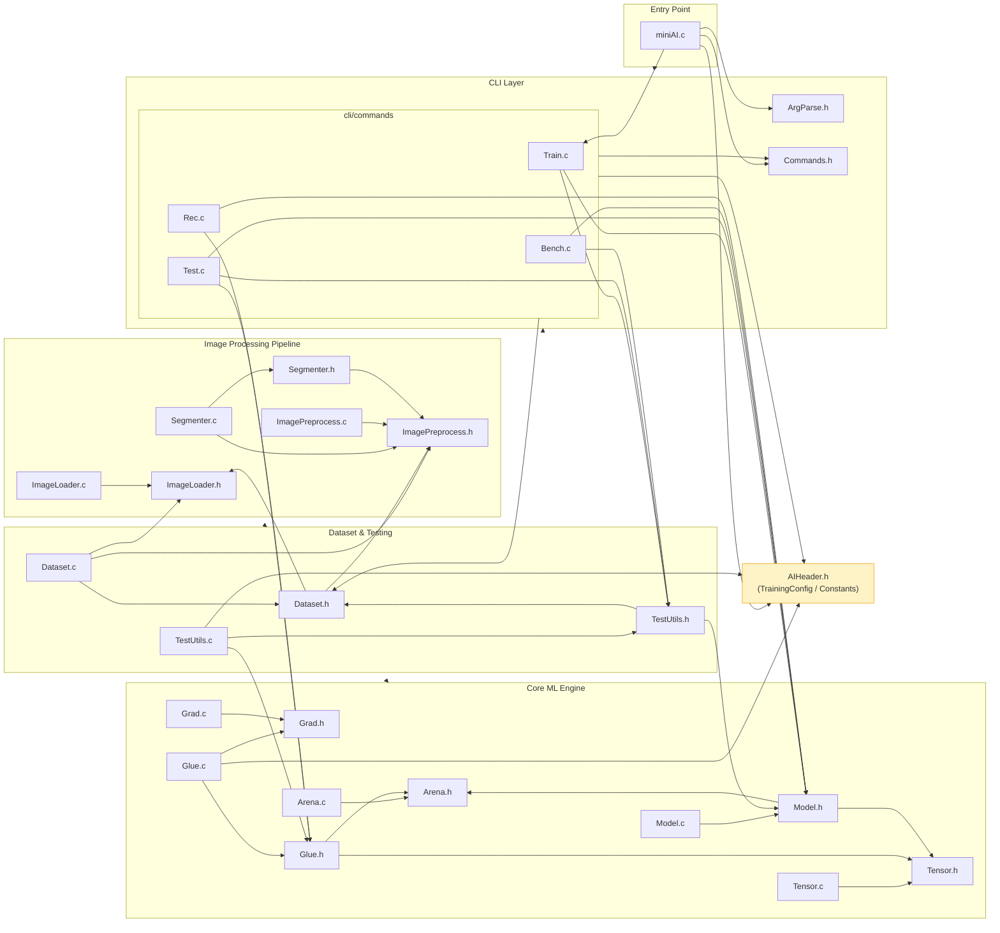
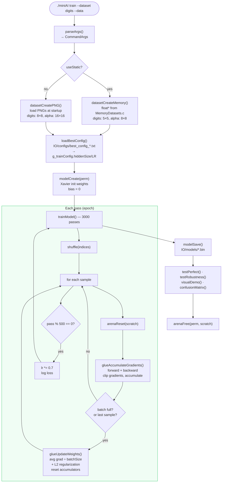
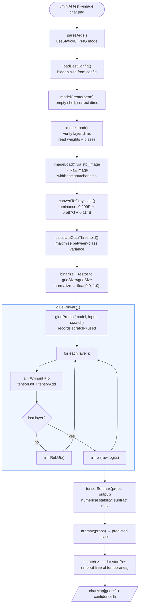
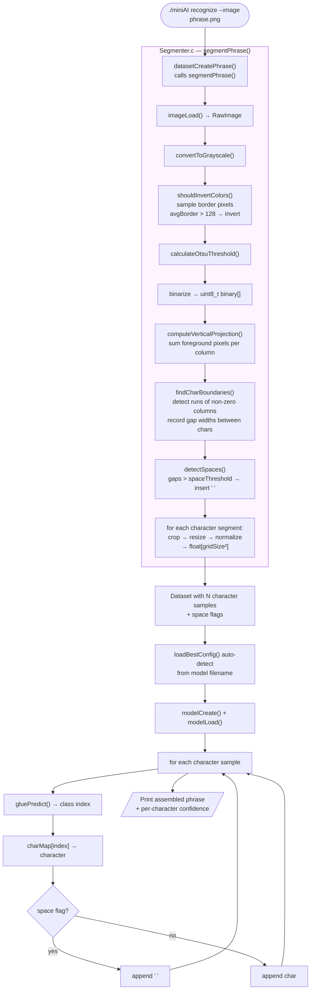
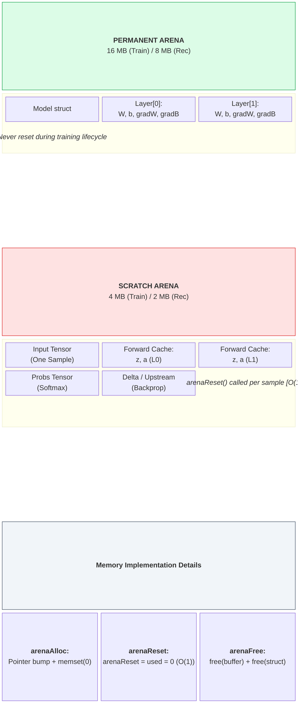
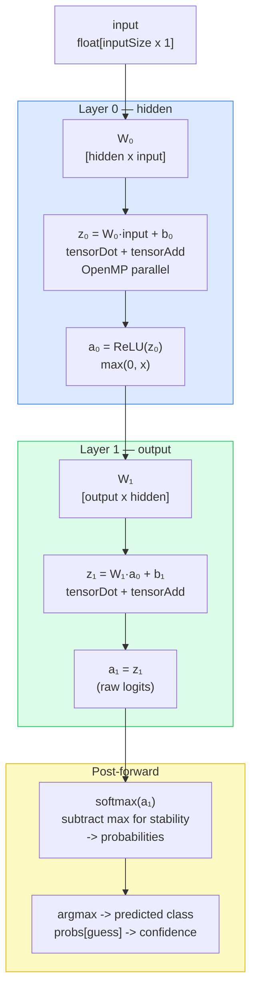
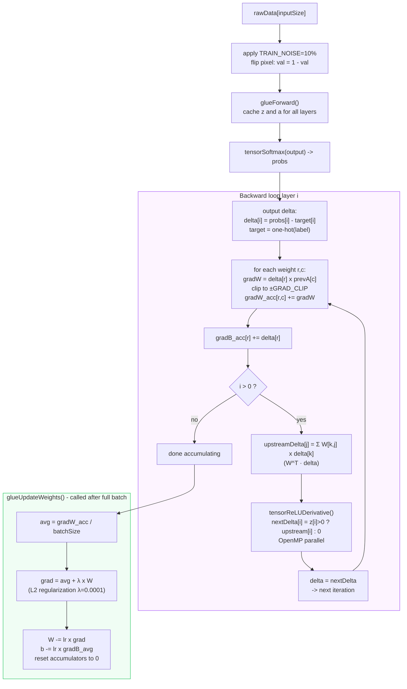
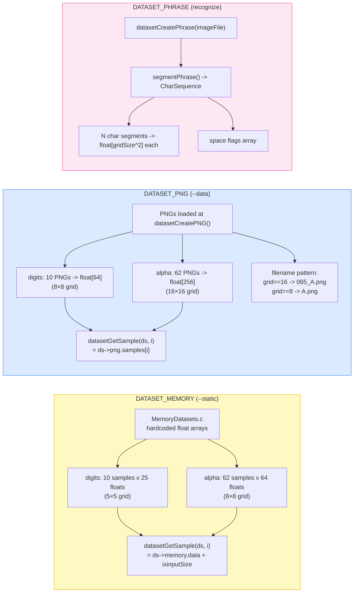

# Architecture Diagrams

---

## 1. System Architecture

High-level components and their responsibilities.

---

## 2. Module Dependencies

Actual `#include` relationships between `.c` files and headers.

---

## 3. Training Data Flow

Exact sequence executed by `cmdTrain()` → `trainModel()`.

---

## 4. Inference Data Flow

Sequence for `cmdTest()` with a single image (`--image`).

---

## 5. Phrase Recognition Flow

How `cmdRecognize()` processes a full phrase image.

---

## 6. Memory Architecture

How the two arenas are used during training.

---

## 7. Neural Network — Forward Pass

Exact operations in `glueForward()` for a 2-layer network (input → hidden → output).

---

## 8. Backpropagation — One Sample

Exact algorithm in `glueAccumulateGradients()`.

---

## 9. Dataset Type Comparison

